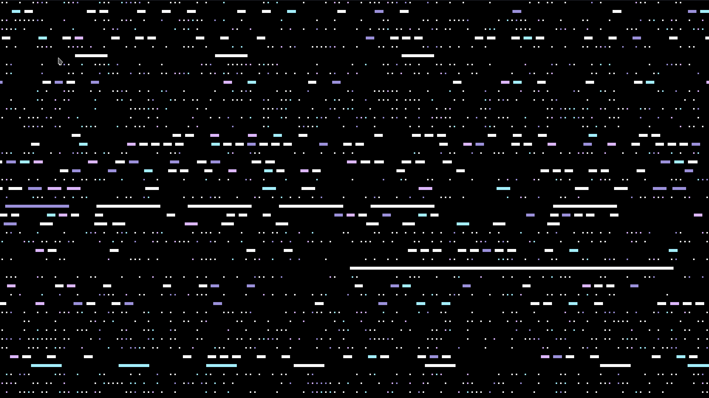

# Description

This is a music visualization of Grimes' "Delete Forever". It is the 
first one after I moved a number of recurring classes to an 
openFrameworks addon, 
[ofxMusicVisualization](https://github.com/gevhaz/ofxMusicVisualizationKit).

# Screenshot

.

# Usage

I cannot distribute the actual song but if you have it, name it 
"delete-forever.mp3" and put it under `bin/data/music` and the project 
should work.

You will also need my addon ofxMusicVisualizationKit for this project to 
run. Clone it to your addons folder:

```
git clone https://github.com/gevhaz/ofxMusicVisualizationKit.git
```

Keyboard shortcuts for playback:

*   Space key: Start the music playback.
*   <kbd>→</kbd>: Jump 15 seconds forward.
*   <kbd>←</kbd>: Jump 15 seconds backward. 
*   <kbd>s</kbd> Stop the playback. 
*   <kbd>f</kbd>: Toggle fullscreen.

# Licence

This projected is licenced under GPLv3.
